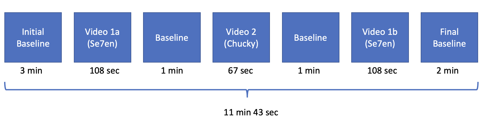
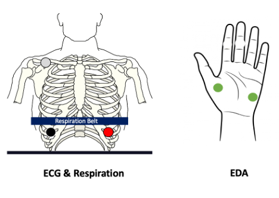

# Study Details

## Task 

**TRAP Task Overview**

- Participants continuously (sampled at 5 Hz) report their subjective experience of arousal throughout the task.
- The rating of arousal does not have bounds: it can increase or decrease without limit. Therefore, all responses should be considered relative within a participant.

**Videos**
- Videos were previously normed in another study (Schaefer et al., 2010)
- https://sites.uclouvain.be/ipsp/FilmStim/ 

## Physiology
**Signals:**

- ECG
- EDA
- Respiration

**Sampling Rate:** 1000 Hz

## Questionnaires

- **Anxiety Sensitivty Index 3 (ASI-3)**
  - Taylor, S., Zvolensky, M. J., Cox, B. J., Deacon, B., Heimberg, R. G., Ledley, D. R., ... & Cardenas, S. J. (2007). Robust dimensions of anxiety sensitivity: development and initial validation of the Anxiety Sensitivity Index-3. Psychological assessment, 19(2), 176.
- **Center for Epidemiological Studies Depression Scale (CES-D)**
  - Radloff, L. S. (1977). The CES-D scale: A self-report depression scale for research in the general population. Applied psychological measurement, 1(3), 385-401.
- **Demographics**
  - BAB Lab
- **Health Questionnaire**
  - From IASL 
- **Interoceptive Accuracy Scale (IAS)**
  - Murphy, J., Brewer, R., Plans, D., Khalsa, S. S., Catmur, C., & Bird, G. (2020). Testing the independence of self-reported interoceptive accuracy and attention. Quarterly Journal of Experimental Psychology, 73(1), 115-133.
- **Multidimensional Assessment of Interoceptive Awareness (MAIA-2)**
  - Mehling WE, Acree M, Stewart A, Silas J, Jones A (2018) The Multidimensional Assessment of Interoceptive Awareness, Version 2 (MAIA-2). PLoS ONE 13(12): e0208034.
- **Questionnaire of Uncertainty in Childhood (QUIC)**
  - Glynn, L. M., Stern, H. S., Howland, M. A., Risbrough, V. B., Baker, D. G., Nievergelt, C. M., ... & Davis, E. P. (2019). Measuring novel antecedents of mental illness: the Questionnaire of Unpredictability in Childhood. Neuropsychopharmacology, 44(5), 876-882.
- **Toronto Alexithymia Scale 20 (TAS-20)**
  - Bagby, R. M., Parker, J. D., & Taylor, G. J. (1994). The twenty-item Toronto Alexithymia Scale—I. Item selection and cross-validation of the factor structure. Journal of psychosomatic research, 38(1), 23-32.